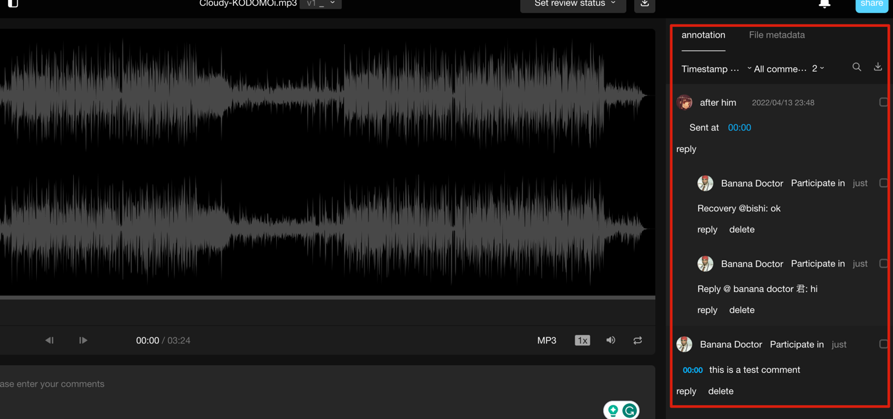

# simple-comment-sys
A microservice backend for usual comment system that can be applied in social media. it provides full RESTful API in Golang

## Design
Actually, 90% of apps can use a simple comment design, which is a one-on-one Q&A format, similar to the following design.

This design is very simple, straightforward, and meets the basic requirements of user comments and replies. It's sufficient for apps that don't have a large number of user comments or where commenting is not a core feature. Let's temporarily call this scenario 'Scenario A.'

If you have a news or information app with a large number of user comments, designing a 'nested' effect can be beneficial. This helps users find the context of a specific comment or reply. However, the design may vary depending on how the 'nested' display is implemented. If the primary display is comment-centric, it looks like the following:

Here, comments are divided into 'comments' and 'replies,' and all 'replies' are nested under 'comments' in a tree-like structure. Let's call this scenario 'Scenario B.'

Finally, there's the comment design similar to that of Netease News, shown in the screenshot:

In this scenario, the design is more complex because replies and comments are at the same level, and replies can reference the entire reply path, allowing tracing back to the original comment. I'll refer to this scenario as 'Scenario C.'

#### Database Design:
Since I have always used MySQL as an example, I will discuss the design for the three scenarios mentioned above using MySQL.

##### Scenario A:
In this scenario, the number of comments is generally low, and comments are not very active. You can treat comments and replies as the same thing, considering them as comments. The difference lies in whether some comments are direct comments on a 'topic' (each comment is attached to a specific topic, such as an article or post), while others are '@' mentions of other users. To cover both of these situations, a single table can achieve the desired effect. The comment table is designed as follows:

Table Fields:

id: Primary Key
topic_id: Topic ID
topic_type: Topic Type
content: Comment Content
from_uid: User ID of the Commenter
to_uid: Target User ID
To differentiate between different types of topics, we introduce a 'topic_type' field. 'from_uid' represents the commenter's ID, which allows us to retrieve the relevant information about the commenter.

'to_uid' is the ID of the target user being mentioned. If there is no target user, this field remains empty.

For performance reasons, we often denormalize information about the commenter into the comment table, such as the commenter's nickname and avatar. The same can be done for target users. This way, we only need to query a single table to display the information.

Sometimes, there may be multiple target users. In such cases, you can modify the '​​to_uid' field to 'to_uids,' storing multiple user IDs separated by a delimiter. The information about multiple target users can be stored as JSON, depending on the simplicity of the display requirements.

##### Scenario B:
In the tree-like display scenario, where comments are the primary focus, database design is very flexible. You can use a single table and add a 'parent_id' field to point to the parent comment. If your database supports nested queries, such as SQL Server or Oracle, it's convenient. However, MySQL does not support nested queries, so you would need to implement this with stored procedures. In web applications, it's best to avoid using triggers and stored procedures when possible, as they can impact performance.

You can also split comments into 'comment' and 'reply' tables, where 'comments' are attached to various 'topics,' and 'replies' are nested under 'comments.' The design for the 'comments' table is as follows:

Table Fields:

id: Primary Key
topic_id: Topic ID
topic_type: Topic Type
content: Comment Content
from_uid: User ID of the Commenter
The 'replies' table is designed as follows:

Table Fields:

id: Primary Key
comment_id: Comment ID
reply_id: ID of the Target Reply
reply_type: Reply Type
content: Reply Content
from_uid: User ID of the Replier
to_uid: Target User ID
Since we've split comments and replies, the 'comments' table no longer needs the 'to_uid' field, as all comments represent user comments on a topic, making the design more concise.

In the 'replies' table, I've added a 'comment_id' field to indicate which root comment the reply is associated with. This design decision is made for performance considerations. You can retrieve all replies to a comment by querying the 'reply_id' field and programmatically arrange the display structure. Using appropriate denormalization techniques to improve performance is a common optimization.

The 'reply_type' field indicates whether the reply is directed at a 'comment' or another 'reply,' distinguishing between these two scenarios.

The 'reply_id' field represents the ID of the target reply. If 'reply_type' is 'comment,' 'reply_id' equals 'comment_id.' If 'reply_type' is 'reply,' 'reply_id' signifies the parent reply.

In terms of data structure design, I've included a 'List<ReplyDTO> next' property in the 'replyDTO.' This forms a tree-like structure similar to the following:

Tree Structure

Clients can use this structure to display nested comments.

##### Scenario C:
To achieve the commenting effect similar to Netease News, there is no straightforward solution. In this scenario, comments and replies are displayed at the same level, and replies do not need to be nested under a comment. The dual-table design may not be suitable here because it involves mixing comments and replies in the display, making query logic too complex. It's better to use a single-table design without distinguishing between comments and replies to simplify the application layer. We consider all of them as comments, but some comments can reference other comments. I recommend using a closure table design, for example:

##### Comment Table Design:

Table Fields:

id: Primary Key
topic_id: Topic ID
topic_type: Topic Type
content: Comment Content
from_uid: User ID of the Commenter
Parent-Children Table:

Table Fields:

id: Primary Key
parent_id: Parent ID
child_id: Child ID
The comment table stores all comment content, while the parent-children table records the parent-child relationships between comments.

When querying, comments are often sorted by time, and you can directly query the comment table by 'id' or creation time in descending order. If users want to view a comment's complete references, they can find the corresponding path using the parent-children table. To find comments above a specific comment, you can execute:

### DataBase
Mysql

### Cache
memcache + redis

### message queue
databus (kafka)

### API
http RESTful + gRPC

### Framework
Gin Web FrameWork https://github.com/gin-gonic/gin

